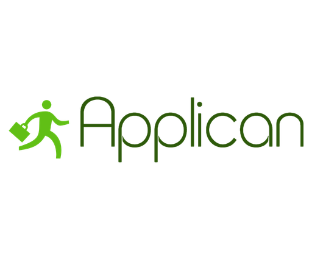

# Applican
>  Applican is a full-service platform that helps people manage their job search. Its intuitive and easy-to-use interface helps job seekers stay organized while they land their dream job.


## Table of Contents

1. [Team](#team)
1. [Getting Started](#getting-started)
1. [Requirements](#requirements)
1. [Development](#development)
1. [Contributing](#contributing)

## Team
AppliCan is developed by four fullstack engineers.
* **Anthony Ochmanowicz** 
* **Christine Zhao** 
* **Henry Han** 
* **Jason Lushthaus**
 

## Getting Started

Follow these instructions if you want to fork the repo and start developing on your own. You do not need to follow these steps if you want to use our deployed build of [Applican](http://www.applican.xyz).

### Prerequisites & Installing

1. Fork the repo and clone it to your development environment of choice.

2. To install Applican's dependencies, run the following command from the cloned repo's directory: 

```npm install```

### Configuration

You will need several environment variables and API Keys to run your own build of Applican. We use the NPM package [dotenv](https://github.com/motdotla/dotenv) for our local environment variables. You should make a .env file, placed in your clone's root directory, that looks like this:

```
AWS_ACCESS_KEY_ID=(AWS user  key with appropriate security policy to access S3 bucket)
AWS_SECRET_ACCESS_KEY=(Associated secret key)
EXPRESS_SESSION_SECRET=(a secure value to hash Express session) 
S3_BUCKET=(S3 bucket address for storing user uploads)
GOOGLE_CLIENT_ID=(Google oauth client ID) // Available from [Google](https://console.developers.google.com)
GOOGLE_CLIENT_SECRET = (Google oauth client secret) Available from [Google](https://console.developers.google.com)
RDS_DB_URL=(SQL database address)
```


Keep in mind that your database's environment variable requirements may be different. Applican is set up to use Sequelize with PostgreSQL on AWS RDS.


## Built With

* [React](https://facebook.github.io/react/) - Facebook's powerful JavaScript framework
* [Redux](http://redux.js.org/) - Efficient state manager for web applications
* [Node.js](https://nodejs.org) - JavaScript runtime
* [Express](https://expressjs.com/)- Fantastic Node.js web server framework
* [Passport](http://passportjs.org/) - Library for various authentication strategies in Node.js
* [PostgresSQL](https://www.postgresql.org/) - Object-relational database
* [Sequelize](www.sequelizejs.com) - Powerful ORM tool for SQL databases
* [SASS](http://sass-lang.com/) - Extension of CSS
* [Victory](https://formidable.com/open-source/victory/) - 
Modular charting and data visualization library for React.js
* [Webpack](https://webpack.github.io/) - Module bundler


## Contributing

Please read [CONTRIBUTING.md](CONTRIBUTING.md) for details on our code of conduct, and the process for submitting pull requests.

[Contributors](https://github.com/jlusthaus/applican-/contributors) are welcome and will be clearly acknowledged.

## License

This project is licensed under the MIT License - see the [LICENSE.md](LICENSE.md) file for details